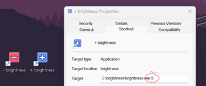
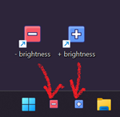

# Win Brightness

Simple app that uses WinAPI to adjust monitor brighness with HDR (relative brightness of SDR and HDR) or falls back to physical monitor brigness while HDR is disabled.

The physical monitor configuration functions to adjust brightness work using the VESA Monitor Control Command Set (MCCS) standard over an I2C interface. Many monitors don't fully implement that standard. 

> ! It is not recommend using these functions for arbitrary monitors without validating the aformentioned standards are supported.

Uses Win10 WinAPI (0x0A00) - dxva2, user32.

## Usage

Usage: brightness.exe (increment percentage between -100 to 100)

* Increase brighness example: brightness.exe 10
* Decrease brighness example: brightness.exe -10

## Setting up Windows shortcuts

Create desktop shortcuts with predefined values to increase and decrease brightness.

Add shorcuts to taskbar and move into the first and second position after windows logo.

Use keyboard shorcut keys <kbd>Windows Key</kbd>+<kbd>1</kbd> and <kbd>Windows Key</kbd>+<kbd>1</kbd> to adjust brightness.